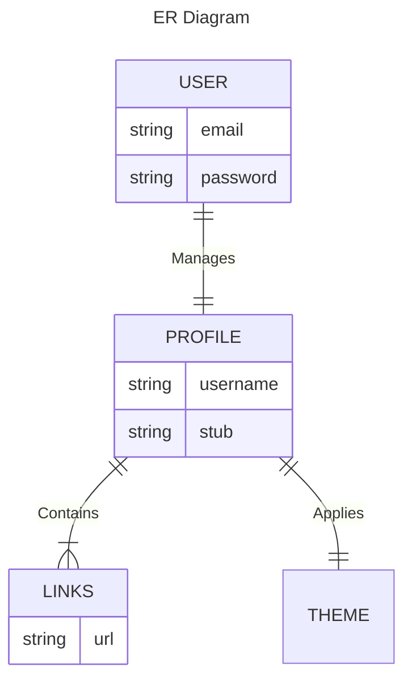

# Translating into MongoDB

Strict schemas aren't necessary, but this diagram is a good rule of thumb. Some notes for later:
- Many to Many -> Create a Many to one to Many between the two
- Mongodb: Many to one -> the many contain reference to one's document
- Mongodb: One to One -> Each refer to each other with a reference

