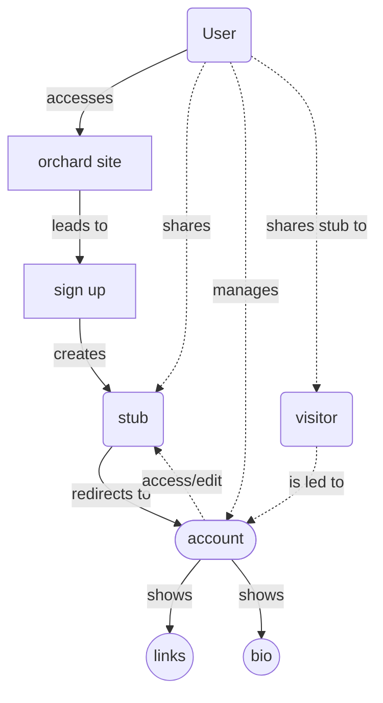

```mermaid
flowchart TD

user(User)
v(visitor)
o[orchard site]
s[sign up]
st(stub)
acc([account])
l((links))
b((bio))

user -->|accesses| o
o -->|leads to| s
s -->|creates| st
st -->|redirects to| acc

user -.->|shares| st
user -.->|manages| acc
acc -.->|access/edit| st
user -.->|shares stub to| v

v -.->|is led to| acc

acc -->|shows| l
acc -->|shows| b
```